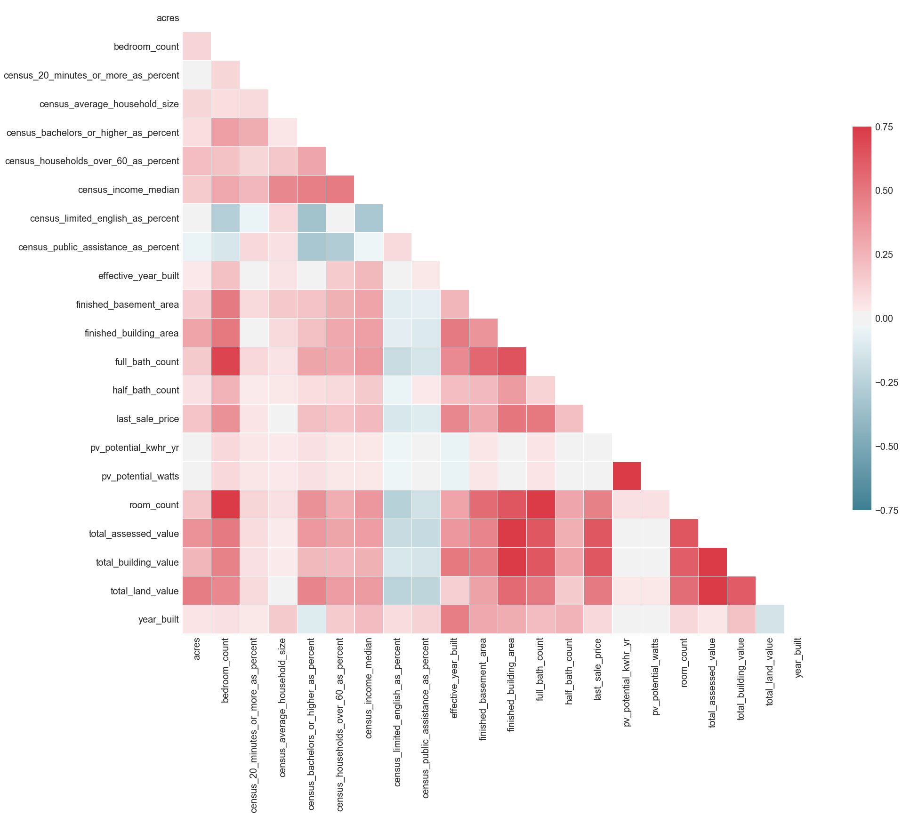
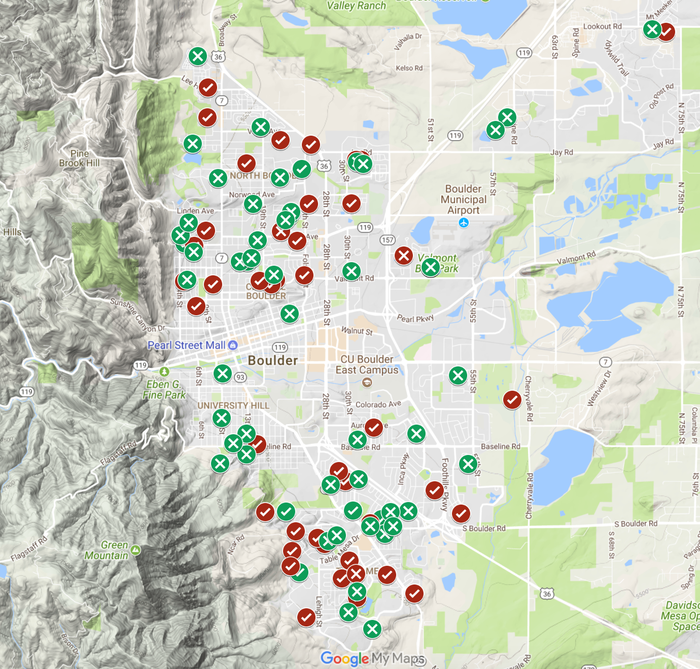
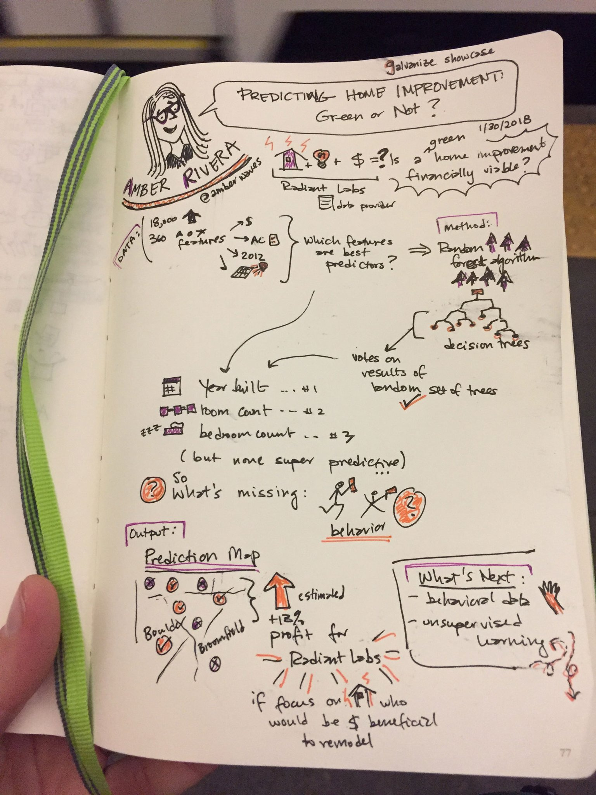

# Predicting Home Improvement: Green Or Not?

*This is my independent capstone project for the Data Science Immersive at Galvanize. It was a two-week project, managed under the Agile scrum framework with a program instructor as scrum master.*

**Goal:** Working with data from a home energy upgrades company,
use machine learning to predict a household's propensity to install an energy efficiency upgrade. This will enable the company to better target ideal candidates for energy efficiency upgrades, aiming to cut down on the average cost of customer acquisition and to increase annual revenue.

**Technologies Used:**
* [Python](https://www.python.org/) programming language.
* [pandas](https://pandas.pydata.org/) open source library for data analysis.
* [NumPy](http://www.numpy.org/) library for scientific computing in Python.
* [scikit-learn](http://scikit-learn.org/stable/index.html), a free software machine learning library for Python.
* In particular, scikit-learn's [Pipeline constructor](https://gist.github.com/amberjrivera/8c5c145516f5a2e894681e16a8095b5c).
* [imbalanced-learn](http://contrib.scikit-learn.org/imbalanced-learn/stable/index.html) for class imbalance issues.
* [Matplotlib](https://matplotlib.org/api/pyplot_summary.html), [Seaborn](https://seaborn.pydata.org/index.html) and [Google](https://support.google.com/mymaps/answer/3024396?hl=en&ref_topic=3188329) for visualization.

## Contents
1. [The Question and Motivations](#the-question-and-motivations)
2. [Data Preparation](#data-preparation)
4. [Modeling and Results](#modeling-and-results)
5. [Future Work](#future-work)
6. [Acknowledgements](#acknowledgements)
6. [About Me](#about-me)

## The Question and Motivations
**Looking at the building characteristics of a single-family residence, some Census information, and simulated assumptions about home energy use, is it possible to identify homes that will install an energy efficiency upgrade?**

Have you ever considered doing a home improvement that is energy efficient? If you've thought about it but haven't done it yet, why not? Maybe the timing wasn't right, or you had more pressing financial priorities...but, is there perhaps an even more fundamental logic underlying that decision? For my capstone I partnered with Radiant Labs and Fuel Switch, sister companies that are using data and analytics to help more people make energy efficiency upgrades. I set out with existing data that they had aggregated, to see if I could use machine learning to build a predictive model that identifies those homes most likely to make an upgrade. Some examples of home energy upgrades are adding insulation, updating an old gas furnace, replacing a gas furnace with an electric heat pump, installing a new water heater, switching to an electric vehicle, or going solar (PV panels on the roof, or solar thermal for hot water).

For a homeowner, the benefit of upgrading is lower monthly utility bills. For the city or county running a home energy efficiency program to recruit households to upgrade, a main motivation is to reduce overall carbon emissions to meet climate change goals. For the company offering home energy audits and upgrade services, knowing which homes are more likely to upgrade reduces the overall cost of finding the right customer, and can mean more annual revenue.

Currently, the company's strategy for acquiring new customers is guided by their ability to identify homes whose equipment is on its last legs (think heating and cooling, water heaters). It would be more powerful, however, to overlay that information with a household's likelihood to install a home energy upgrade, to identify the homes with the highest potential. That set of homes is what this project aims to identify.

## Data Preparation
The training dataset, provided to me by the company, includes data aggregated from publicly available sources and data simulated using [NREL's ResStock](https://www.nrel.gov/buildings/resstock.html) tool. The size of the data is 18,400 samples (homes), with 360 features with 18% of the data missing. The classes are imbalanced, with only 9% of the instances in the positive class (defined as a home that has completed a home energy upgrade).

### Cleaning and Missing Values
I built a Preprocessing class to tidy up and flesh out the data before modeling. I dropped building attributes that were missing more than 75% of values, any redundant or irrelevant attributes, and any attributes or rows that would leak information about the target to the algorithm. I also dropped instances that were missing `last_sale_date` and `last_sale_price`, as I did not have the time to properly research that information to fill in the missing values. After those steps, the dataset was 17,300 x 205 with 30% numerical attributes and 70% categorical.

Given the time constraints, I handled missing values thoughtfully but bluntly. For numeric attributes, I filled with the median value of all non-null observations, except for a home's solar PV potential, which I filled with the mode (while there is likely diversity in the size, pitch and orientation of rooftops, homes are all located in the same 25 square mile geographic area). I filled all missing values in categorical attributes with their mode, except for `zillow_neighborhood`, which I filled with 'Unknown'.

### Features
There was a fair amount of collinearity in many of the numeric features, which tipped me off that I would need to do some regularization or choose an algorithm that is robust to correlated features.

I had what I suspected would be predictive information about homeowner permits, but it was sparse. To keep it, I created a summarizing feature for each home, `num_permits_since_purchase`. There is a lot more that could be done with this information, and I hope to extract more features from it in a future iteration of the analysis.

As a proxy for measuring whether social influence is a factor in a home's likelihood to install a home energy upgrade, I created three spatial clustering features, `num_upgrades_subdivision`, `num_upgrades_parcel`, and `num_upgrades_zip`. For each home, these features count the number of homes in the same group that have already upgraded. Subdivision has the highest resolution of the three with 785 different categories, and serves as a good proxy for Census Block Group, while zip code has only a handful of groups. Later, I looked at feature importances to see which of these levels of grouping would be most predictive, and ended up keeping only `num_upgrades_parcel`.

### Class Imbalance
As mentioned, the classes were rather imbalanced with only 9% of the data in the positive class. In thinking and researching through the best way to handle this, I learned of diverging philosophies on the matter. There were two decisions to be made: method of balancing, and level of balancing.

In my first pass, I chose to balance the classes to 75/25 majority/minority (has not upgraded / has upgraded). I downsampled to drop the number of majority class instances necessary to reach 75/25 balance, which left a much smaller dataset to train on, 6564 x 206. It seemed like a shame to lose so many of the samples, so I also explored random over sampling (bootstrapping) and SMOTE techniques to instead bring the minority class up into balance with the majority class.

Ultimately, I balanced the classes in the training dataset to 50/50, and chose the technique that generalized best to unseen data which, somewhat surprisingly, ended up being the simple downsampling of the majority class.

## Modeling and Results
Before running the data through any algorithms, I split off a third of it (using sklearn's `train_test_split`) to set aside and use later to score the final model. It's important to have this "unseen" data in order to get a measure of model performance that is not inflated by overfitting the prediction to the training data. With the other two thirds, I used k-fold cross validation with four folds to compare classifiers for this binary classification problem.

### Identifying The Best Classifier
I started by running my clean, engineered, and balanced feature matrix through various classifiers, from simple Logistic Regression to the more complex Multi-Layer Perceptron, to see which scored the best. I initialized several classifiers available in sci-kit learn with their out-of-the-box defaults plus a bit of tuning based on intuition.

I chose to evaluate my classifier based on its Recall score, averaged across cross validation folds. Recall is the true positive rate: out of all the homes that really would do an upgrade, how many did the model identify? I was aiming to minimize the number of false negative predictions: If Radiant Labs doesn't talk to a home, it misses out on a 40:1 profit:cost ratio, and on the chance to reduce carbon emissions. On the other hand, if they mistakenly speak to someone who will not actually upgrade (false positive), it doesn't cost them very much, and they've at least planted a seed about their services.

With a bit more manual tuning on the top five performing classifiers, and a reasonable amount of grid searching first using sklearn's `GridSearchCV` and then `RandomizedSearchCV`, Random Forest and Gradient Boosting rose to the top of the pack. This checked out against my earlier exploratory data analysis, when I found multicollinearity among many features -- both algorithms are robust to this problem. While there are certainly datasets with a worse high dimensionality problem than this one, 200 attributes is still a lot; and, thinking about how this model may scale as the company grows, it's reasonable to think that additional attributes could make their way into the dataset. Again, both algorithms are robust to high dimensionality. So, how to choose?

Once I had my code well-structured using sklearn's `Pipeline` constructor, I decided to do a deeper grid search, pitting Random Forest against Gradient Boosting. Once they were both optimized, I gave them each the unseen data to see how they would generalize, and Random Forest was the clear winner. One of the benefits of using `Pipeline` and `GridSearchCV` together is that you can more conveniently treat data preparation steps as hyperparameters. This allows you to tune not only the final algorithm, but the entire process. For instance, you can do blunt imputations to fill missing values to get a working model; tune that model to reasonable performance; then experiment with swapping out more complex methods for the cleaning and engineering transforms upstream of the model to see if performance improves. I did this a bit by swapping in different methods for dimensionality reduction/feature selection, but that became less important when I selected the Random Forest algorithm.

### Results

Class     | Precision | Recall | f1-score | Support
----------|-----------|--------|----------|---------
negative  | 0.94      | 0.53   | 0.68     | 4716
positive  | 0.13      | 0.70   | 0.23     | 490
avg/total | 0.87      | 0.55   | 0.64     | 5206

__Table 1:__ Random Forest Classifier scores on holdout data. 

#### Feature Importances
Feature Ranking        | Score
-----------------------|--------
Year Built             | (0.047)
Room Count             | (0.040)
Bedroom Count          | (0.033)
Last Sale Price        | (0.027)
Finished Building Area | (0.027)
Effective Year Built   | (0.019)
Building Condition     | (0.013)
Finished Basement Area | (0.007)
Stories                | (0.0005)
Attached Garage        | (0.0003)

__Table 2:__ Top ten predictive features in final model. The score of *all* importances in the model sums to 1.

I mapped a subset of the test data to demonstrate visually the model's 0.55 Recall score.
  * Green checkmarks are True Positives
  * Red checkmarks are False Positives
  * Green X's are True Negatives
  * Red X's are False Negatives

### Business Implications
Even though the predictive power of the model topped out at a 0.55 Recall score, the analysis provided new insight that Radiant Labs and Fuel Switch can incorporate into their work. By applying ratio of the True Positives and False Positives from this model to their annual volume of home upgrades, we found that this kind of modeling has the potential to increase annual profit by 13%.

*[visual TK: confusion matrix and profit curve]*

## Future Work
Here are some ideas for improving upon this project:
- Compare more sophisticated imputation methods, such as plugging into the Zillow API to fill in missing sale date and sale price when predicting on new data.
- Further engineer off of the permits features, encoding their most useful info into the dataset.
- Find and incorporate relevant behavioral information for each household to improve performance.
- Incorporate unsupervised techniques to see whether there are any natural patterns or clusters among the data.

## Acknowledgements
- Official documentation for [pandas](https://pandas.pydata.org/pandas-docs/stable/) and [scikit-learn](http://scikit-learn.org/stable/documentation.html).
- *["Python For Data Analysis, 2nd Edition"](http://shop.oreilly.com/product/0636920050896.do)* by William McKinney (O'Reilly). Copyright 2017.
- *["Hands On Machine Learning with Scikit-Learn and TensorFlow"](http://shop.oreilly.com/product/0636920052289.do)* by Aurélien Géron (O'Reilly). Copyright 2017.
- Batista, G., Prati, R. and Monard M. [A Study of the Behavior of Several Methods for Balancing Machine Learning Training Data.](http://citeseerx.ist.psu.edu/viewdoc/download?doi=10.1.1.58.7757&rep=rep1&type=pdf)
- Isaac Laughlin's [Pipeline how-to video.](https://www.youtube.com/watch?v=0UWXCAYn8rk)
- A **big** thank you to Galvanize instructor [Elliot Cohen](https://github.com/Ecohen4), who served as advisor and cheerleader on this project, and to all of my instructors during the immersive.
- I was lucky to get connected to a company that understands the power of predictive modeling, and was willing to let me use their data for my project. Thank you, Radiant Labs!

## About Me
I'm new to data science, but not to data analysis. My background is in modeling portfolio risk in the solar financing industry and advising on public policy based on market research and modeling. I'm available for contract data work, and seeking a full-time position where I can program machine learning and other advanced analytics solutions. I thrive in situations where people want to know the fundamental truth of their business, organization, or market as much as I do. Connect with me on [LinkedIn](www.linkedin.com/in/amberjrivera) or [send me an email](<amberjrivera@gmail.com>) with any question, critique, or idea for this project!

Sketchnotes from my 01-30-18 capstone presentation, compliments of the ever-creative [Jordan Wirfs-Brock](https://twitter.com/jordanwb) who is the person that told me I was meant for data science. #IEforever
